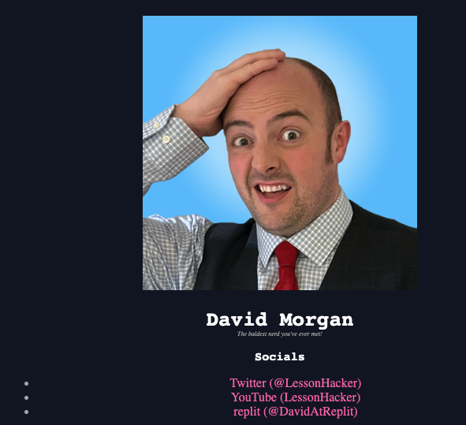

# 👉 Day 75 Challenge

As the great Jon Bon Jovi almost sang:

*Wooooahhh, we're three quarters of the way there....*

OK, OK, lame joke. But seriously, huge kudos on making it to day 75.

Your reward is a project day.

Today, you'll be making your own link tree website. Something that you can share instantly to showcase your skills.

## One Link To Rule Them All
A link tree site is a little bit like a portfolio, but it also contains links to your socials as well as examples of your work.

Having a link tree means that you can put one single link in your socials profile, and that you only have to edit one place to update your links across multiple platforms.

Your link tree should have:
1. A picture of you at the top
2. Your name & social media handles
3. A series of mid size headings that link to examples of your work, your profiles and anything else that you're proud of.

## Example

 
 💡 Hints 

  
- The [W3 Schools](https://www.w3schools.com/css/) website is an absolute goldmine for HTML and CSS resources.

By the way, since you are 75% of the way done, we are curious to know if you would like a certificate to show off all your new skills when you make it to the end. Let us know [here](https://forms.gle/HvHWJj1MQ4VdyGmg8).